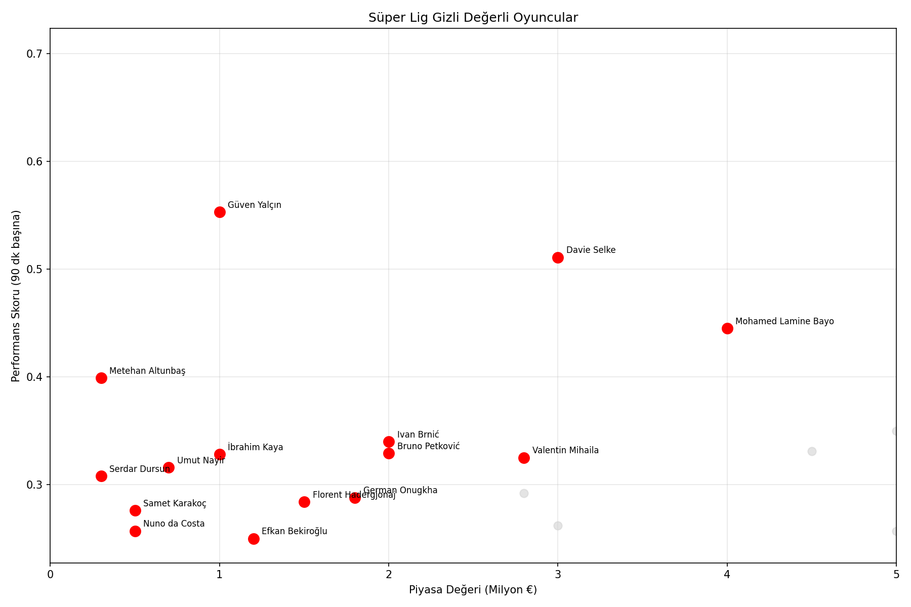

# Süper Lig Gizli Değerli Oyuncu Analizi

## Motivasyon
Sezon sonuna yaklaşırken transfer haberleri ve oyuncu tartışmaları hep aynı 
isimlerin etrafında dönüyor. Sessiz sedasız işini yapan, büyük takımlarda 
oynamayan ama sahada fark yaratan oyuncuları bulmak amacıyla analiz yapılmştır.

## Yöntem

### Performans Skoru
Oyuncular pozisyonlarına göre farklı ağırlıklarla değerlendiriliyor:
- **Forvetler:** Gol x0.7 + Asist x0.3
- **Orta sahalar:** Gol x0.4 + Asist x0.6

Tüm metrikler **90 dakika başına** hesaplandı. Böylece az maç oynayan ama 
o az dakikada parlayan oyuncuların yarattığı yanılgı önlendi. Ek olarak 
minimum 15 maç filtresi uygulandı.

### Yaş Faktörü
Yaş değişkeni bilinçli olarak ayrı ele alındı. 35 yaşında, piyasa değeri 
düşmüş ama hâlâ performans gösteren bir oyuncu ile 22 yaşında henüz 
keşfedilmemiş bir oyuncu aynı skoru almamalı. Buradaki asıl soru şu: 
**"Bu oyuncuyu kim transfer etmek ister?"** Genç oyuncular daha yüksek 
çarpanla değerlendiriliyor çünkü potansiyel değeri de fiyata yansıması gerekiyor.

| Yaş | Çarpan |
|-----|--------|
| ≤23 | 1.5x |
| ≤26 | 1.2x |
| ≤29 | 1.0x |
| ≤32 | 0.8x |
| 32+ | 0.6x |

### Gizli Değer Skoru
`Gizli Değer = (Performans Skoru / Piyasa Değeri) × Yaş Çarpanı`

## Sonuçlar

Grafikteki en değerli bölge **sol üst köşe** — düşük piyasa değeri, yüksek 
performans. Bu bölgedeki oyuncular analizin asıl hedefi.

**Öne çıkan isimler:**

- **Güven Yalçın (Alanyaspor, 1M €):** Tüm metriklere en uygun oyuncu. 
  Küçük bir takımda 8 gol atarak sezonun sessiz golcülerinden biri oldu.
- **Metehan Altunbaş (Eyüpspor, 300K €):** Performans metriği rakiplerine 
  göre düşük kalsa da 23 yaşı ve piyasa değeriyle öne çıkıyor. Uzun vadeli 
  bir yatırım profili.
- **Davie Selke (Başakşehir, 3M €):** Yüksek performans gösteriyor ancak 
  piyasa değeri bu listedeki diğer oyunculara kıyasla yüksek. Model maliyet-etkinlik 
  sıralaması sunduğu için listede daha aşağıda yer alıyor.

## Projenin Limitleri

- **Pozisyon adaletsizliği:** Defans oyuncuları için hamle, sahipsiz top kazanımı, 
  hava topu gibi kritik metrikler bu analizde yer almıyor. Bu durum defans 
  oyuncularını sistematik olarak dezavantajlı kılıyor.
- **Veri güncelliği:** Transfermarkt verileri manuel toplandı. Ara transfer 
  döneminde takım değiştiren oyuncular farklı değerlerle görünüyor olabilir.
- **Eşleştirme hatası:** İki veri kaynağı fuzzy matching ile birleştirildi. 
  355 oyuncunun bir kısmında yanlış eşleştirme riski mevcut.

## Gelecekte Yapılabilecekler
- Defans metrikleri eklenerek her pozisyon için özel skorlama sistemi kurulabilir.
- xG (beklenen gol) gibi gelişmiş metriklerle mevcut skor karşılaştırılabilir.
- Avrupa'nın diğer liglerini kapsayacak şekilde genişletilebilir.
- Otomatik veri güncelleme pipeline'ı eklenerek her hafta güncel sonuçlar üretilebilir.

## Kurulum
pip install -r requirements.txt
streamlit run app.py

## 🌐 Canlı Demo
[Uygulamayı buradan kullanabilirsiniz](https://super-lig-gizli-deger.streamlit.app)
